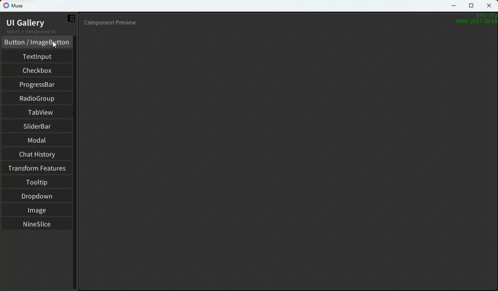

# Muse

[中文](README.md) | [English](README.EN.md)

**缪斯** 是基于 [LÖVE](https://love2d.org/) 游戏引擎的桌面级 UI 框架，使用 Lua 编写。实现了一套完整的 widget 系统，包括布局引擎、主题系统、文本输入、滚动列表、Flexbox 布局等功能。

> 本库大量使用了 LLM 生成代码，请自行评估使用风险。



## 安装

### 前置条件

- [LÖVE](https://love2d.org/) 11.5（使用 LuaJIT，基于 Lua 5.1 + 扩展）

### 作为子模块引入（推荐）

```bash
git submodule add https://github.com/liximi/muse.git lib/muse
```

然后在你的 `main.lua` 中加载 Muse：

```lua
Class = require "lib.muse.dependencies.classic"
local UiManager = require "lib.muse.ui.ui_manager":GetInstance()
```

### 复制到项目中使用

将以下目录和文件复制到你的项目（如 `lib/muse/`）：

**必须复制**：
```
ui/                      # UI 框架全部源码
dependencies/classic.lua  # OOP 类系统（必须）
dependencies/tween.lua    # 补间动画（Scroll 等需要，必须）
```

**可选复制**：
```
dependencies/lovebird/    # 远程调试控制台（开发用，可省略）
dependencies/i18n/        # 本地化框架 + localization/ 目录（多语言用，可省略）
assets/                   # 字体文件和图片（如使用内置字体则复制）
```

**不需要复制**：
```
tests/            # 测试场景
docs/             # 文档
main.lua          # 示例程序入口
conf.lua          # 示例 LÖVE 配置
CLAUDE.md         # AI 辅助提示
muse-feedback.md  # 反馈记录
```

### 直接以此仓库运行

```bash
love .
```

按 `Escape` 退出。运行后在浏览器打开 `http://127.0.0.1:8000` 可查看 Lovebird 远程调试控制台。

## 快速开始

> 以下代码假设你在 Muse 仓库根目录运行 `love .`。若已将 Muse 作为 `lib/muse` 引入项目，将 require 路径前缀改为 `lib.muse.`。

```lua
-- 1. 导入依赖
Class = require "dependencies.classic"
local UiManager = require "ui.ui_manager":GetInstance()
local Widget = require "ui.widgets.widget"
local Panel = require "ui.widgets.panel"
local Button = require "ui.widgets.button"
local Utils = require "ui.utils"

function love.load()
    -- 2. 创建根容器
    local root = UiManager:addWidget(Widget({
        anchor = {0, 0, 1, 1},   -- 填满整个窗口
        padding = {0, 0, 0, 0},
    }))

    -- 3. 添加子 widget
    local btn = root:addChild(Button({
        pivot = {0.5, 0.5},
        anchor = {0.5, 0.5, 0.5, 0.5},  -- 居中
        w = 160,
        h = 40,
        normal = Utils.newButtonStateStyle("Click Me", Utils.UI_COLORS.TITLE, 16,
                    Utils.UI_COLORS.BTN_NORMAL, nil, nil, nil, nil, 4),
        on_click = function()
            print("Hello, World!")
        end,
    }))
end

-- 4. 在 LÖVE 回调中转发事件
function love.update(dt)
    UiManager:update(dt)
end

function love.draw()
    UiManager:draw()
end

function love.keypressed(key, scancode, isrepeat)
    UiManager:KeyPressed(key, isrepeat)
end

function love.textinput(text)
    UiManager:TextInput(text)
end

function love.mousepressed(x, y, button)
    UiManager:MousePressed(x, y, button)
end

function love.mousereleased(x, y, button)
    UiManager:MouseReleased(x, y, button)
end

function love.mousemoved(x, y, dx, dy)
    UiManager:MouseMoved(x, y, dx, dy)
end

function love.wheelmoved(x, y)
    UiManager:WheelMoved(x, y)
end
```

## 依赖

| 依赖 | 路径 | 源代码 | 用途 |
|------|------|--------|------|
| **classic** | `dependencies/classic.lua` | [rxi/classic](https://github.com/rxi/classic/) | OOP 类系统，提供简化的类继承机制（接口略有调整） |
| **tween** | `dependencies/tween.lua` | [kikito/tween.lua](https://github.com/kikito/tween.lua) | 补间动画库，Scroll 容器和 CollapsiblePanel 用其实现平滑动画 |
| **Lovebird** | `dependencies/lovebird/` | [rxi/lovebird](https://github.com/rxi/lovebird) | 远程调试控制台（HTTP `:8000`），仅开发环境使用 |
| **i18n** | `dependencies/i18n/` | [excessive/i18n](https://github.com/excessive/i18n) | 本地化框架（当前仅 zh-cn），用于 UI 文本多语言支持 |

核心依赖只有 **classic** 和 **tween**。Lovebird 和 i18n 是可选的开发/辅助依赖。

## 核心系统

| 系统 | 文档 | 简介 |
|------|------|------|
| **Widget（基类）** | [docs/widget.md](docs/widget.md) | 所有 UI 元素的基类，提供树结构、Transform 布局、事件分发和生命周期 |
| **Transform** | [docs/transform.md](docs/transform.md) | Anchor-based 布局引擎，支持锚点、支点、旋转、缩放，递归全局坐标计算 |
| **Theme** | [docs/theme.md](docs/theme.md) | 主题样式系统，支持按 widget 类型的默认样式和自定义主题覆盖 |
| **Fonts** | [docs/fonts.md](docs/fonts.md) | 字体管理器，提供统一的字体注册、懒加载缓存和查询机制 |
| **UiManager** | [docs/ui-manager.md](docs/ui-manager.md) | 全局单例，管理根 widget 层级、焦点、主题和事件分发 |

## 组件列表

### 基础组件

| 组件 | 简介 | 文档 |
|------|------|------|
| **Panel** | 纯色面板，可设置背景色、描边和圆角 | [docs/panel.md](docs/panel.md) |
| **Text** | 文本渲染，支持 coloredtext、自动换行和多方向对齐 | [docs/text.md](docs/text.md) |
| **Image** | 贴图渲染，支持 tint 着色和 clamp 模式拉伸填充 | [docs/image.md](docs/image.md) |
| **NineSlice** | 九宫格切图渲染，自适应尺寸的边框/面板效果 | [docs/nineslice.md](docs/nineslice.md) |

### 按钮组件

| 组件 | 简介 | 文档 |
|------|------|------|
| **Button** | 文字按钮，6 种状态样式（normal/pressed/hover/selected/selected_hover/disabled） | [docs/button.md](docs/button.md) |
| **ImageButton** | 图片按钮，附加纹理/tint 切换，可选附带文本 | [docs/imagebutton.md](docs/imagebutton.md) |
| **Checkbox** | 复选框，支持方框+对勾和滑动开关两种样式 | [docs/checkbox.md](docs/checkbox.md) |
| **RadioButton** | 单选按钮，圆形轮廓+实心圆点，继承 Checkbox | [docs/radiobutton.md](docs/radiobutton.md) |
| **RadioGroup** | 单选按钮组，管理 RadioButton 的互斥行为 | [docs/radiogroup.md](docs/radiogroup.md) |

### 输入组件

| 组件 | 简介 | 文档 |
|------|------|------|
| **TextInput** | 文本输入框，光标控制、选区、剪贴板、撤销/重做 | [docs/textinput.md](docs/textinput.md) |
| **SliderBar** | 滑块，支持水平/垂直方向、拖拽、长按步进、整数步长模式 | [docs/sliderbar.md](docs/sliderbar.md) |
| **ProgressBar** | 进度条，支持水平和垂直方向 | [docs/progressbar.md](docs/progressbar.md) |

### 容器组件

| 组件 | 简介 | 文档 |
|------|------|------|
| **Modal** | 模态框，全屏半透明遮罩 + 居中内容，Escape/点击外部关闭 | [docs/modal.md](docs/modal.md) |
| **TabView** | 标签页视图，顶部 Button 栏 + 下方内容面板 | [docs/tabview.md](docs/tabview.md) |
| **Scroll** | 滚动容器，scissor 裁剪 + 可选滑条 + 补间动画 | [docs/scroll.md](docs/scroll.md) |
| **List** | 线性列表容器，子元素按主轴依次排列，自动布局 | [docs/list.md](docs/list.md) |
| **Box** | Flexbox 式布局容器，flex_grow/shrink 伸缩分配 | [docs/box.md](docs/box.md) |

### 浮层组件

| 组件 | 简介 | 文档 |
|------|------|------|
| **Tooltip** | 鼠标悬停提示，可设延迟、最大宽度和位置偏移 | [docs/tooltip.md](docs/tooltip.md) |
| **Dropdown** | 下拉选择，触发按钮 + 弹出选项列表（支持滚动） | [docs/dropdown.md](docs/dropdown.md) |

### 高级组件

| 组件 | 简介 | 文档 |
|------|------|------|
| **ChatBubble** | 聊天气泡，左/右对齐 + 自定义样式 | [docs/chat-history.md](docs/chat-history.md) |
| **ChatHistory** | 聊天历史列表，管理气泡的显示、追加和样式更新 | [docs/chat-history.md](docs/chat-history.md) |
| **CollapsiblePanel** | 屏幕边缘停靠可收起面板，outQuint 缓动动画 | [docs/collapsible-panel.md](docs/collapsible-panel.md) |

## 架构概览

### 类继承体系

```
Widget (基类)
├── Panel
├── Text
├── Image
├── NineSlice
├── ProgressBar
├── Modal
├── TabView
├── RadioGroup
├── ButtonBase
│   ├── Button
│   ├── ImageButton
│   └── Checkbox
│       └── RadioButton
├── TextInput
├── SliderBar
├── Scroll
├── List
├── Box
├── Tooltip
├── Dropdown
└── ChatHistory（内含 ChatBubble）
```

### Transform 布局模型

Transform 实现了类似 Unity 的 anchor-based 布局：

- **点锚点**（`min == max`）：固定尺寸，位置由 `x`/`y` 偏移
- **拉伸锚点**（`min < max`）：自适应尺寸，由锚点范围减 padding 决定

详见 [Transform 文档](docs/transform.md)。

### 事件传播

事件从 `UiManager` 分发到 hierarchy（后添加的 widget 先收到），通过 `handleEvent` 递归进入子节点：

- **子节点优先** — 倒序遍历 children
- **拦截机制** — 子节点 handler 返回 `true` 则事件不再传播
- **生命周期** — `update` → `draw（分层）`，焦点管理，键盘/鼠标事件

### Theme 优先级

```
datas 直接参数 > 自定义 theme > UiManager 默认 theme
```

详见 [Theme 文档](docs/theme.md)。

## Widget 通用参数

所有 widget 构造时都支持以下 datas 字段（通过 Transform 处理）：

```lua
{
    pivot = {x, y},           -- 支点 0~1（默认 {0, 0}）
    anchor = {minx, miny, maxx, maxy},  -- 锚点（默认 {0, 0, 0, 0}）
    x = number, y = number,   -- 位置（像素）
    w = number, h = number,   -- 尺寸（像素）
    sx = number, sy = number, -- 缩放（默认 1）
    padding = {left, right, top, bottom},  -- 内边距（像素）
    r = number,               -- 旋转（弧度）
}
```

## 编码规范

项目中的代码遵循以下规范（编写新 widget 时应当遵循）：

- **缩进**：Tab
- **命名**：局部变量/字段 `snake_case`，方法 `camelCase`，类名 `PascalCase`，常量 `UPPER_CASE`
- **Class 系统**：`Class(BaseClass, function(self, datas, theme) ... end)`
- **事件处理器**：`on` + PascalCase 事件名，如 `onMousePressed`、`onSizeChanged`
- **Widget 文件结构**：require → 私有函数 → 类定义 → 公有方法 → 事件处理器 → return
- **Widget 文件头部**应有结构注释描述 `datas` 接受的字段

## 字体

本库使用 [Noto Sans SC](https://fonts.google.com/noto/specimen/Noto+Sans+SC) 系列字体，基于 [SIL Open Font License 1.1](https://openfontlicense.org/) 授权。

Muse 内置了**字体管理器（Fonts）**，提供按 key + size 的懒加载与缓存机制，支持注册自定义字体。详见 [Fonts 文档](docs/fonts.md)。

## 许可证

[MIT](LICENSE)
